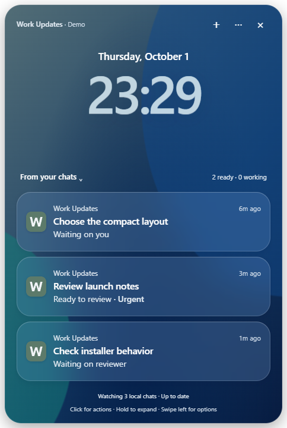
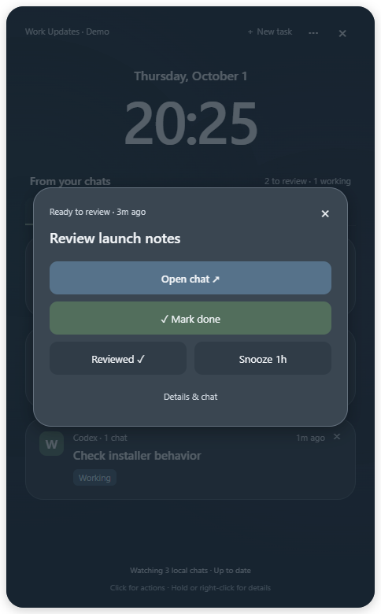

# Work Updates

A small native desktop queue for work spread across Codex chats. See what needs attention, queue the next task, and keep its conversation close.



## Use it

- **Click a card** for Open chat, Mark done, Reviewed and Snooze 1h.
- **Hold or right-click** for details and a compact conversation. Keyboard users can press Shift+F10 or choose Details & chat.
- **New task** saves a title and prompt in Queued. Start chat creates one dedicated Codex conversation. Queue & start chat is also available.
- **From your chats ⌄** switches between Updates, Queued and Done. The main surface stays a simple lock-screen notification stack.
- **Done** closes the actual task. Reviewed only acknowledges an update. Undo and Reopen are available; neither action archives the source chat.
- **Weather shortcut on Windows** uses the existing bottom-left taskbar weather area. Hover to peek without taking keyboard focus; click there or in the queue to keep it open. Drag the top to move it, and click the weather area again to hide. A temporary peek closes when you leave it; a retained window remembers where you moved it. Enable Open queue from the weather area in Settings. The weather remains visible; no extra W button appears. macOS keeps the optional bottom-left launcher.
- **Swipe left** on a notification to reveal Snooze 1h and Reviewed. Neither runs until you choose it.
- **Waiting on you** stays first, followed by urgent tasks. Other waiting cards name the person or team when explicitly recorded. Missing ownership appears as **Waiting · owner unclear**; details let you set who or override urgency.
- **Chat groups** combine related source chats into a connected notification stack. Manage, edit, ungroup or undo a group from Settings. In details, Your status can override an existing chat's automatic label.

The app updates existing local Codex chats every few seconds. Tasks started in Work Updates stream their replies and approval requests immediately. Ordinary commentary stays quiet; a hidden window can notify when a task is blocked or needs input. A finished agent pass appears as Ready to review, and only you decide when its task is Done.



## Install

Get the packages from [Releases](https://github.com/Al-Yousef/work-updates/releases/latest).

| Device            | Package                                  |
| ----------------- | ---------------------------------------- |
| Windows x64       | Windows .exe installer, or portable .zip |
| Apple Silicon Mac | macOS-arm64 .dmg or .zip                 |
| Intel Mac         | macOS-x64 .dmg or .zip                   |

Install Codex and sign in on the desktop that will run your tasks. The observer is included; an installed copy of Python is not required. Move the Mac app into Applications. This is an unsigned development release; macOS may require its documented **Privacy & Security → Open Anyway** flow after an attempted launch. See [Apple's guidance](https://support.apple.com/en-us/102445). Windows can also show a publisher warning. Checksums accompany each package.

## Pair a native Mac companion

1. On the Windows host, open Settings and choose its private network address under Your other desktop. Copy the pairing code.
2. On your Mac, open Work Updates, paste the code in Settings, and choose Connect to desktop.
3. The Mac window now shows the Windows queue. New tasks and mini-chat messages run on that host using its Codex account and workspaces.

The host must be awake, with Work Updates running. The devices need to reach each other on the same private network or an existing private overlay network. No hosted relay or browser tab is used. If the firewall requests access, allow only the network you intend to pair over. The app does not alter firewall rules. A private overlay network must already be installed and configured to use it away from home.

Pairing is remembered through the OS keychain and reconnects after brief interruptions. Revoke device pairing on the host to remove access. Keep the pairing code private: it grants access to task contents and task submission. Disconnect on the companion to remove its remembered connection.

## Privacy

The public repository and packages contain app code and **synthetic demo screenshots only**. Chat contents, titles, workspace paths, task state, Codex configuration, credentials, keys and local databases stay in private app data. There are no analytics or automatic uploads. The release workflow builds installers on fresh Windows and Mac runners rather than from a personal installation.

See [SECURITY.md](SECURITY.md) for the renderer sandbox, paired TLS connection, permission behavior and release safeguards. Report bugs using the [issue form](https://github.com/Al-Yousef/work-updates/issues/new/choose); remove private details first.

## Develop

Node.js 24 and Python 3.12 are used by the build workflow. Python is needed only for source development and packaging.

```sh
npm ci
node node_modules/electron/install.js
npm run demo
```

Demo mode is offline and uses invented tasks. To use your local Codex chats, run `npm start`. `npm run dev` reloads renderer edits without restarting active Codex tasks.

```sh
npm test
python -m unittest discover -s tests -p "test_*.py"
npm run test:ui
npm run audit:release
python -m pip install -r requirements-build.txt
npm run build:helper
npm run dist:win  # on Windows
npm run dist:mac  # on macOS
```

`node scripts/live-smoke.cjs --confirm` explicitly creates one harmless chat with your signed-in account to verify a real completion and follow-up. It is never run in public CI.

## How it works

Electron provides native Windows and Mac app windows, tray controls, notifications and OS-keychain access. A read-only Python collector observes existing Codex chat storage. A Node client uses [Codex App Server](https://developers.openai.com/codex/app-server/) for new tasks, streamed replies and approval requests. A small pinned-TLS peer protocol lets the companion operate the host queue. The renderer receives a fixed IPC API and has no Node access.

The existing-chat observer depends on Codex's local storage schema (currently state_5 and thread_history_1). Future Codex changes may require an observer update. Tasks already running in the Codex desktop should be steered in that source chat; Work Updates does not take over a running external pass. Chat titles are inferred conservatively from short explicit requests, with the source chat name as the fallback. This is not a semantic task classifier.

The interaction rules and inspected design references are in [docs/DESIGN.md](docs/DESIGN.md). Windows owns its weather/Widgets tile. This shortcut places an almost transparent input window over the first 144 DIP of the primary taskbar; it does not rebind the tile through a Windows API. It requires Widgets enabled, centered icons and a visible bottom taskbar with auto-hide off. Unsupported layouts remove the input window to keep Start and application content accessible. Turning the shortcut off restores normal Widgets clicks. The tray and keyboard shortcut remain available. Taskbar settings are read only; layout changes are checked every ten seconds and on display changes.

MIT licensed.
